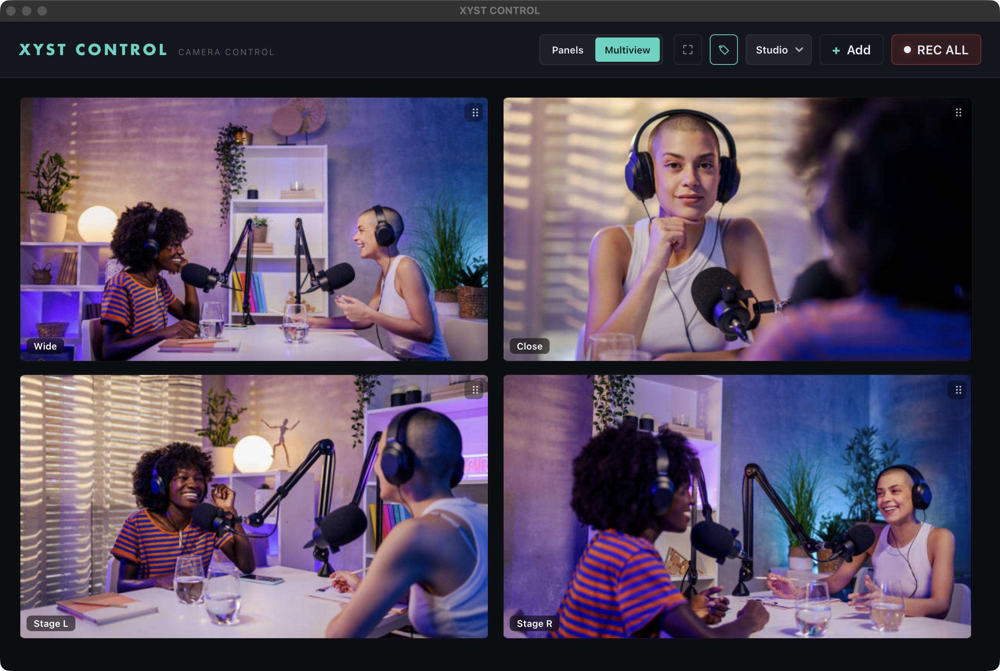
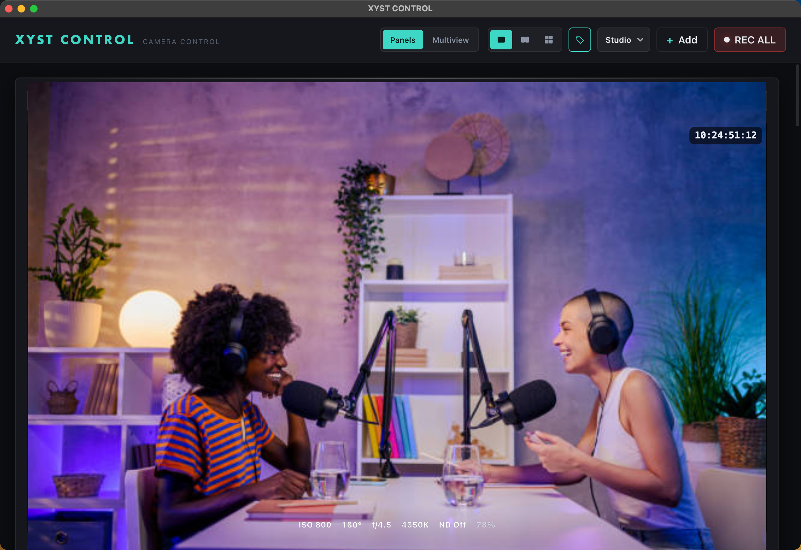
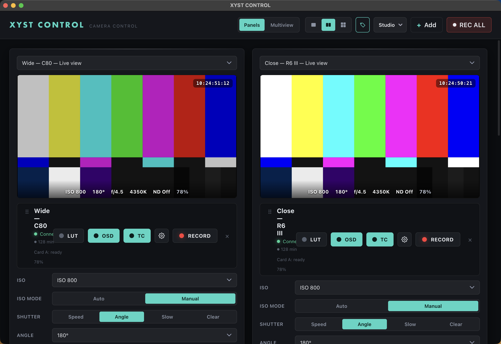
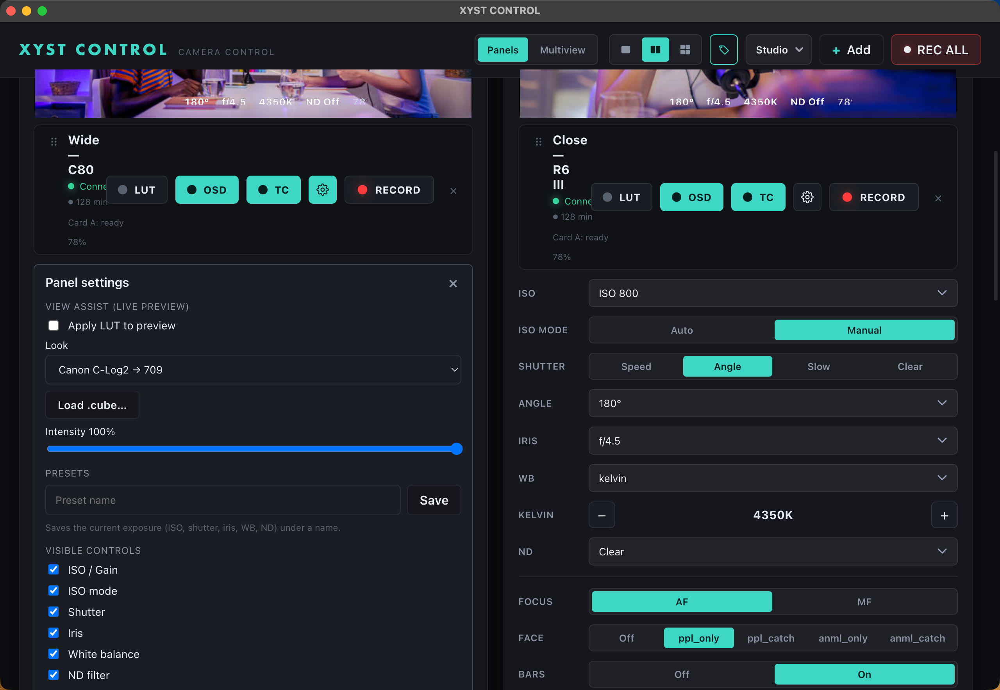

<div align="center">


# XYST CONTROL

### Wired-IP camera control for Canon Cinema EOS

Record, full manual exposure, live view, multiview, and Stream Deck control —
for **Canon cinema bodies** on a wired network, in one dark, touch-friendly desktop app.

-000000?logo=apple&logoColor=white)


<br>



</div>

<table>
  <tr>
    <td width="33%"></td>
    <td width="33%"></td>
    <td width="33%"></td>
  </tr>
  <tr>
    <td align="center"><sub>Live view · on-feed OSD + timecode</sub></td>
    <td align="center"><sub>Full manual control panel</sub></td>
    <td align="center"><sub>View-assist LUT (C-Log → 709)</sub></td>
  </tr>
</table>

---

## What it does

| | |
|---|---|
| 🎬 **Record** | Per-camera, plus **REC ALL / STOP ALL** across every connected body |
| 🎛 **Full manual control** | ISO / gain, shutter (speed *and* angle), iris, white balance + Kelvin, ND — the complete exposure set |
| 🧠 **Capability discovery** | The app asks each camera what it supports and shows only that — no hard-coded model tables, so new bodies just work |
| 💾 **Presets** | Save and recall named exposure snapshots per camera |
| 📺 **Live view + view-assist LUT** | In-app preview with a C-Log → Rec.709 grade (built-in looks or your own `.cube`) — preview-only, never touches the recording |
| 🔲 **Multiview popout** | Resizable 16:9 window, **1–8 camera** grids, tally borders, and **touch focus on every feed** |
| ⏱ **Timecode** | Running timecode on the live feed for Cinema EOS bodies *(new in v0.3.0)* |
| 🎚 **Stream Deck** | Full control from **Bitfocus Companion** — native module with actions, feedbacks, variables, and ready-made presets |
| 🎨 **Five themes** | Aurora · Broadcast · Cinema · Mono · Tactical |

---

## Supported cameras

| Camera | Control protocol | Status | Firmware (verified) |
|---|---|---|---|
| **Canon EOS C300 Mark III** | XC Protocol over Ethernet | ✅ Supported | _TBD at first test_ |
| **Canon EOS C80** | XC Protocol over Ethernet | ✅ Supported | 1.0.2.1 · XC 7.0.0 — 2026-06-15 |
| **Canon EOS R6 Mark III** | CCAPI over HTTPS | ✅ Supported | 1.0.0 — 2026-06-13 |
| **Canon EOS R5 C** | Browser Remote | 🛠 In progress | — |
| Sony FX / Alpha | Camera Remote SDK | 🔭 Planned | — |

> **Keep the firmware column updated** — camera endpoints can change on firmware updates.

Everything runs on a **fully wired network** (cameras + control laptop + Stream Deck on one switch, zero RF).
The app is the single source of truth: Companion and every other client talk to *it*, never directly to a camera.

<details>
<summary><b>Canon R6 III — connection notes</b></summary>

<br>

R6 III CCAPI runs over **HTTPS:443 with a self-signed cert** (the body is its own CA) and
**Digest auth with a static nonce** — run with the camera's CCAPI auth **disabled** until the
client's digest is made stateful (see `packages/core/src/ccapi/driver.ts`). The camera must be
off its "Waiting to connect" screen, and you should pin a **Manual IP** (DHCP reassigns it).

**Log preview looks flat — that's expected.** The protocol preview (`image.cgi` / CCAPI
liveview) follows the **recording gamma**, so a body shooting C-Log2/3 sends a washed-out
frame; the camera's view-assist LUT only lives on its SDI/HDMI outputs. Turn on the per-camera
**LUT** (gear → View assist) for a graded preview — applied in the app, never changes what the
camera records.

</details>

---

## Download

Grab the latest signed & notarized macOS build from the
**[Releases page](https://github.com/missedthepoint1/xyst-control/releases/latest)** —
download the `.dmg`, drag the app to Applications, done. No Gatekeeper prompt.

## Auto-update

The app checks GitHub Releases on launch + every 6h, downloads in the background, and shows an
"Update N ready" banner. **Nothing installs until the operator clicks _Install & Restart_** — so a
running show is never interrupted. _Skip this version_ suppresses re-notification for that release;
_Later_ hides the banner until next launch.

**Release + update test:**
1. Ensure a prior signed release (e.g. 0.4.0) is installed.
2. Bump to the new version, `pnpm package`, then sign + notarize + staple the artifacts
   (`scripts/notarize-dmg.sh`).
3. Publish the new release to GitHub Releases with the `.dmg`, `.zip`, and `latest-mac.yml`
   (and the Windows `.exe` + `latest.yml`).
4. Launch the installed older build → confirm the banner appears → **Install & Restart** →
   app relaunches on the new version. Confirm **Skip this version** suppresses re-notify.

## Build from source

```bash
pnpm install
pnpm test          # run all tests
pnpm dev           # launch the Electron app
pnpm package       # build a signed .dmg (requires the signing cert)
```

Copy `config/cameras.example.json` to `config/cameras.json` and set your camera IP,
or add cameras from the app's **+ Add** button.

---

<details>
<summary><b>Developer reference — Local API (Companion / Stream Deck / web)</b></summary>

<br>

The app exposes a REST + SSE API on `http://127.0.0.1:8088` (override with the
`XYST_API_PORT` env var; it falls forward to the next free port if 8088 is taken).
It wraps the same `CameraManager` as the internal IPC — one command layer, no auth, loopback-only.

### Routes

| Method | Path | Description |
|---|---|---|
| GET | `/api/health` | Health check |
| GET | `/api/cameras` | List all cameras |
| GET | `/api/cameras/:id` | Camera detail |
| GET | `/api/cameras/:id/status` | Flat status: `id, name, status, model, recording, controls{iso,gain,shutter,iris,wb,wbKelvin,nd}` |
| POST | `/api/cameras/:id/record/start` | Start recording (single camera) |
| POST | `/api/cameras/:id/record/stop` | Stop recording (single camera) |
| POST | `/api/record/start` | REC ALL |
| POST | `/api/record/stop` | STOP ALL |
| POST | `/api/cameras/:id/controls/:control` | Set control — body `{"value": <v>}` |
| POST | `/api/cameras/:id/controls/:control/step` | Step a control up/down — body `{"dir": 1 \| -1}` |
| GET | `/api/cameras/:id/presets` | List presets |
| POST | `/api/cameras/:id/presets` | Save preset — body `{"name": "..."}` |
| POST | `/api/cameras/:id/presets/:presetId/recall` | Recall preset (single camera) |
| POST | `/api/presets/:presetId/recall` | Recall preset globally by UUID |
| DELETE | `/api/cameras/:id/presets/:presetId` | Delete preset |
| GET | `/api/events` | SSE live state stream (events: `state`, `status`, `presets`, `osd`) |

### Bitfocus Companion — Generic HTTP examples

```
POST http://127.0.0.1:8088/api/cameras/<id>/record/start
POST http://127.0.0.1:8088/api/record/start          # REC ALL
POST http://127.0.0.1:8088/api/cameras/<id>/controls/iso   body {"value":1600}
POST http://127.0.0.1:8088/api/presets/<presetId>/recall
GET  http://127.0.0.1:8088/api/events                 # SSE live state
```

Use the plain POST/GET routes from Companion. The SSE endpoint (`/api/events`) is
for live state — consumed by the app UI and web clients, not Companion buttons.

</details>

<details>
<summary><b>Developer reference — Native Companion module</b></summary>

<br>

A first-class Bitfocus Companion module lives at `packages/companion-module`
(package `@xyst/companion-module`). It is a pure client of the REST/SSE API
above — no separate camera logic, no `@xyst/core` runtime coupling.

**Build:**

```bash
pnpm --filter @xyst/companion-module build
```

**Load in Companion (dev):**

1. In Companion → Settings → "Developer modules path", point it to
   `<repo>/packages/companion-module`.
2. Add a new connection, search for **xyst-control**.
3. Set **host** = `127.0.0.1` and **port** = `8088` (the app's API).

**Two-stage story:**

| Stage | How | What you get |
|---|---|---|
| Stage 1 — Generic HTTP | Plain POST/GET routes above, available today | Actions only (trigger record, set ISO, recall preset, etc.) |
| Stage 2 — Native module | `packages/companion-module` | Adds **feedbacks** (REC tally turns button red) + **variables** (ISO, shutter, iris, WB, ND, status — per camera) + ready-made **presets** (REC ALL, STOP ALL, OSD toggle) |

**Known limitation:** the camera list is fetched once at connection init
(`GET /api/cameras`). A camera added while the module is connected requires a
connection reload in Companion to appear in dropdowns.

</details>

<div align="center">
<sub>© XYST · Canon Cinema EOS control for live production</sub>
</div>
